# BSN MEDIA

<h4>BSN MEDIA is an intra-buissness social network that allows
members of a business to communicate,
organize, be informed and express their point of view
in matters concerning the company and their colleagues.
This software can be used on the
business sector enabling members of a
team to have remote communication, organization and
cooperation, thus avoiding personal contact, which in
many cases can be time consuming, or even
impossible. The combination of features offered by BSN
Media make the user work experience much more enjoyable.<h4>
<h4>Created as part of the course "Software Technology" (University of Macedonia - Applied Informatics, academic year 2020-2021, 4th semester), from the Group #9, which consists of the following students:.</h4>
<ul>
	<li><b><i>Charakopoulos Minas - Theodoros</i></b></li>
	<li><b><i>Lougaris Dionisios</i></b></li>
	<li><b><i>Machairas Panagiotis</i></b></li>
	<li><b><i>Stefou Georgios Ioannis</i></b></li>
	<li><b><i>Konstantinidi Styliana</i></b></li>
	<li><b><i>Kosmidou Eleni</i></b></li>
	<li><b><i></i>Mazaraki Eleni</b></li>
	<li><b><i></i>Melissanidou Kostantina </b></li>
	<li><b><i>Mertzanis Antonios</i></b></li>
	<li><b><i>Nanou Eleftheria</i></b></li>
</ul>

<h4>Note: Part of our work deliverables were the Software Requirements Description Document, the Software Design Description Document, as well as an analysis of our software metrics after completion. All of these are in the repository folders.</h4>

# How to use it?

The users who will use the program, are members of a
company. Depending on their position in its hierarchy, they are divided into
<b>Employee</b>, <b>Chief</b> and <b>Boss</b> qualities. Each user regardless of his status,
has the ability to exchange messages (encrypted stored conversations with a shifting Ceaser cipher algorithm) and make connections with others
users, post posts, edit personal and public information and much more.
For example, chiefs create groups, consisting of employees, to which they assign projects. These are evaluated by the boss, thus giving an idea of the result and the
collaboration of the Group for the Project assigned to it. In addition there is the possibility of 
supporting BSN Media users through the Help page which has FAQs and a contact form. 
A potential BSN Media user to create an account must know the Verification code which can only
be given by the Boss.

<h4>Frequently asked questions:</h4>
<ol>
	<li>Is BSN Media accessible online?</li>
	<ul><li>In this version BSN Media runs locally on a computer and is not yet available online.</li></ul>
	 
	<li>Can there be a Boss or a Company on BSN Media?</li>
	<ul><li>In this version BSN Media refers to a business with one manager..</li></ul>
	 
	<li>Can the Greek alphabet be used in BSN Media?</li>
	<ul><li>In this version, BSN Media can not encrypt Greek characters, so it is not recommended.</li></ul>
</ol>

# Some screens from the App
<h4>Login to BSN Media - Starter screen</h4>
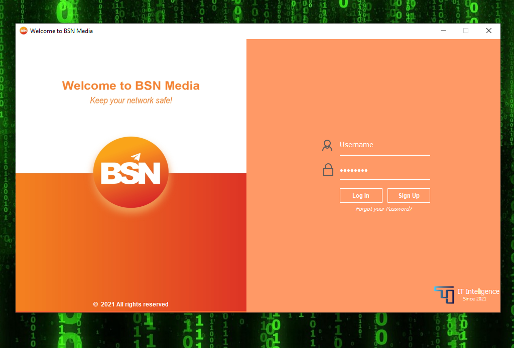

<h4>Create new Account</h4>
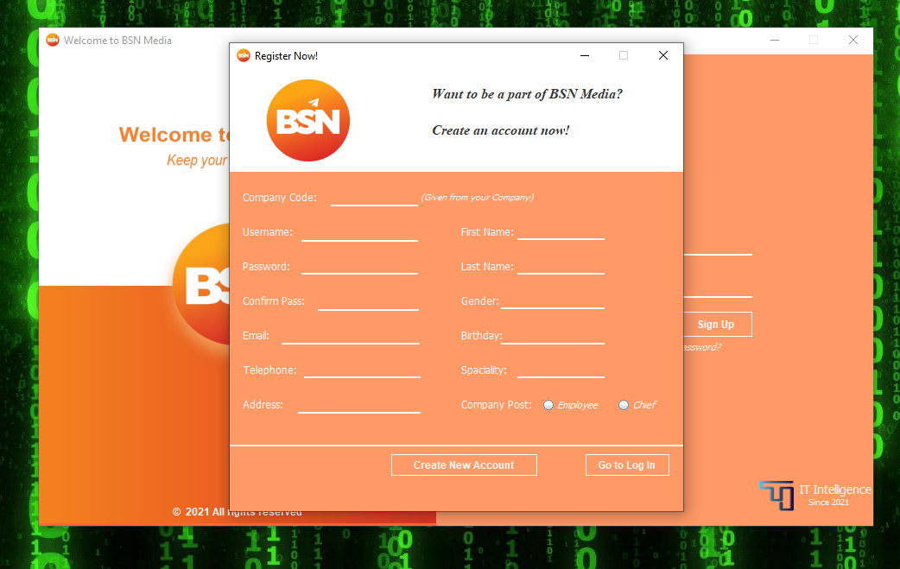

<h4>Retrieve your account</h4>
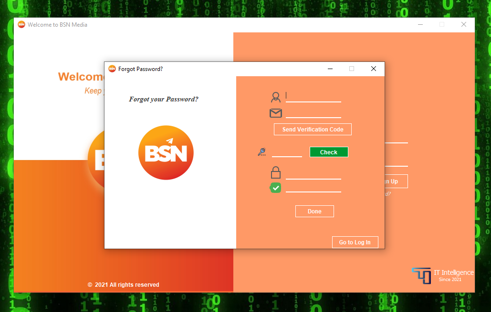

<h4>Edit Account information</h4>
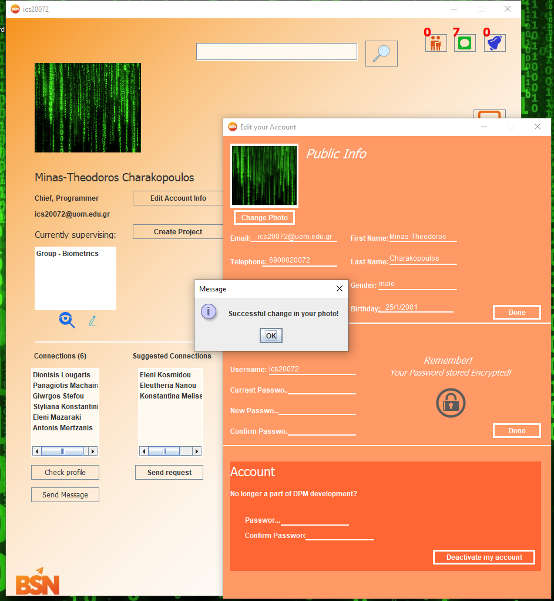

<h4>Create Group and Project</h4>
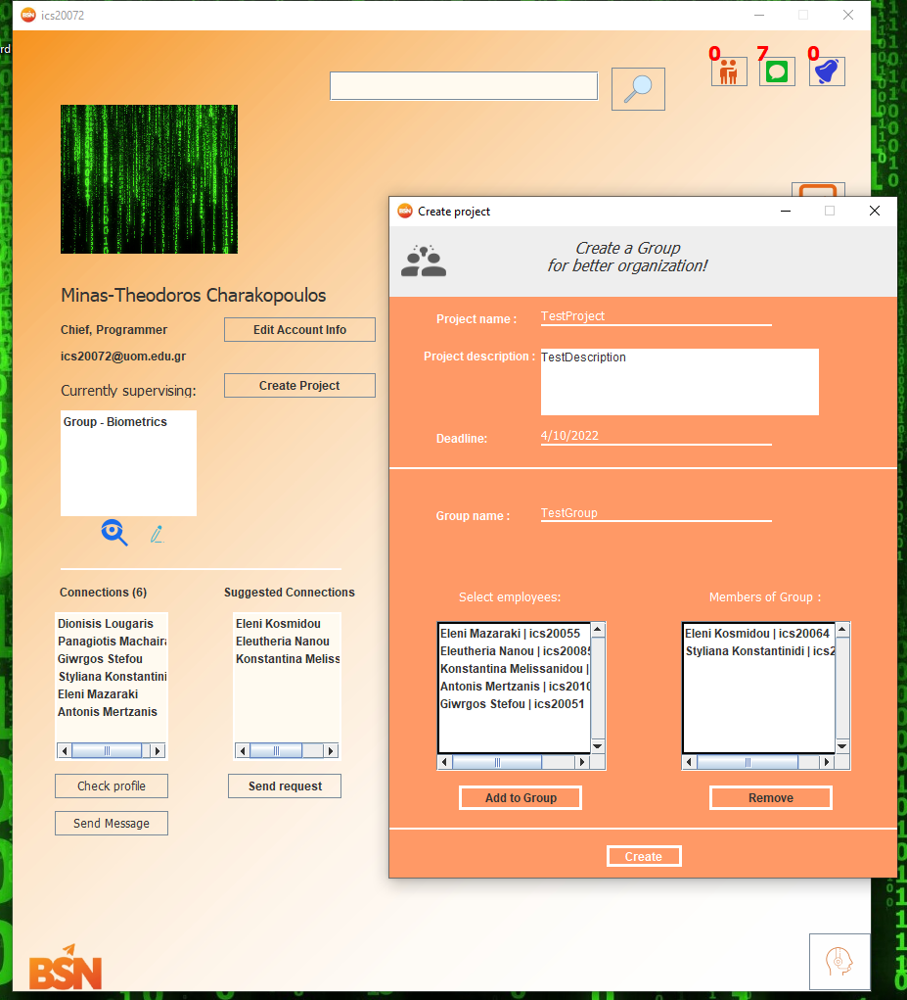

<h4>Conversations</h4>
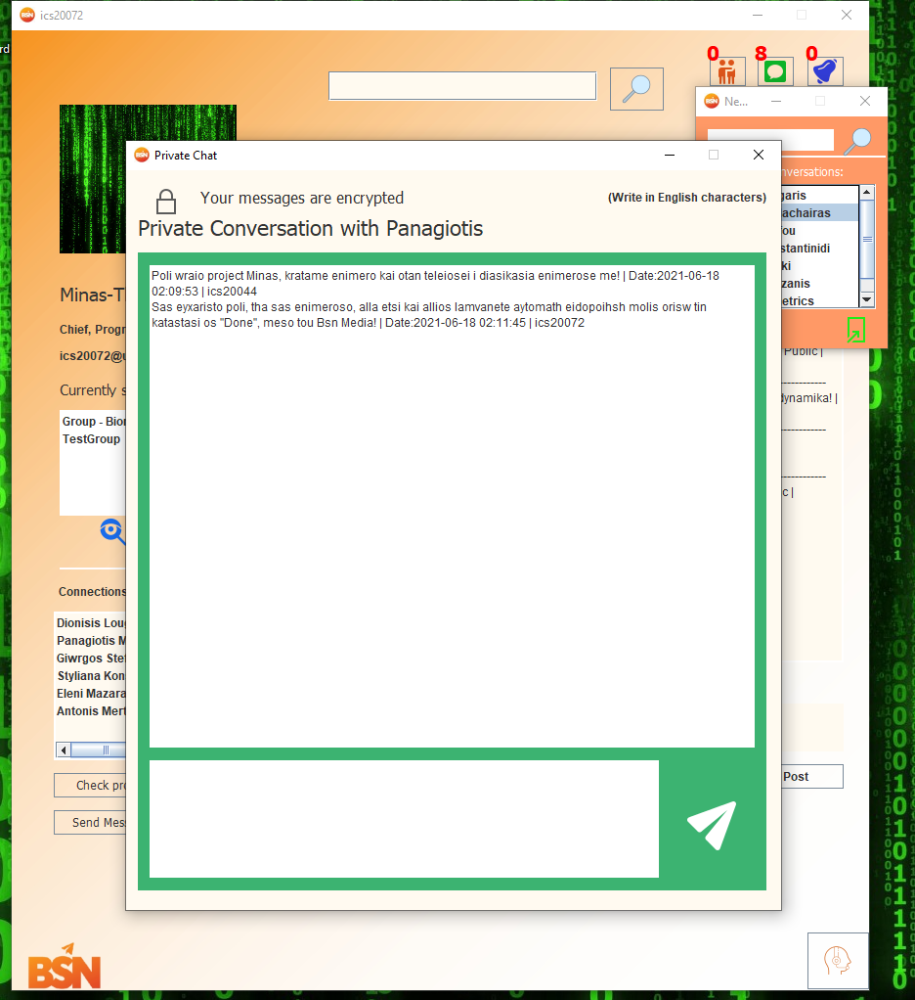

<h4>BSN Support</h4>
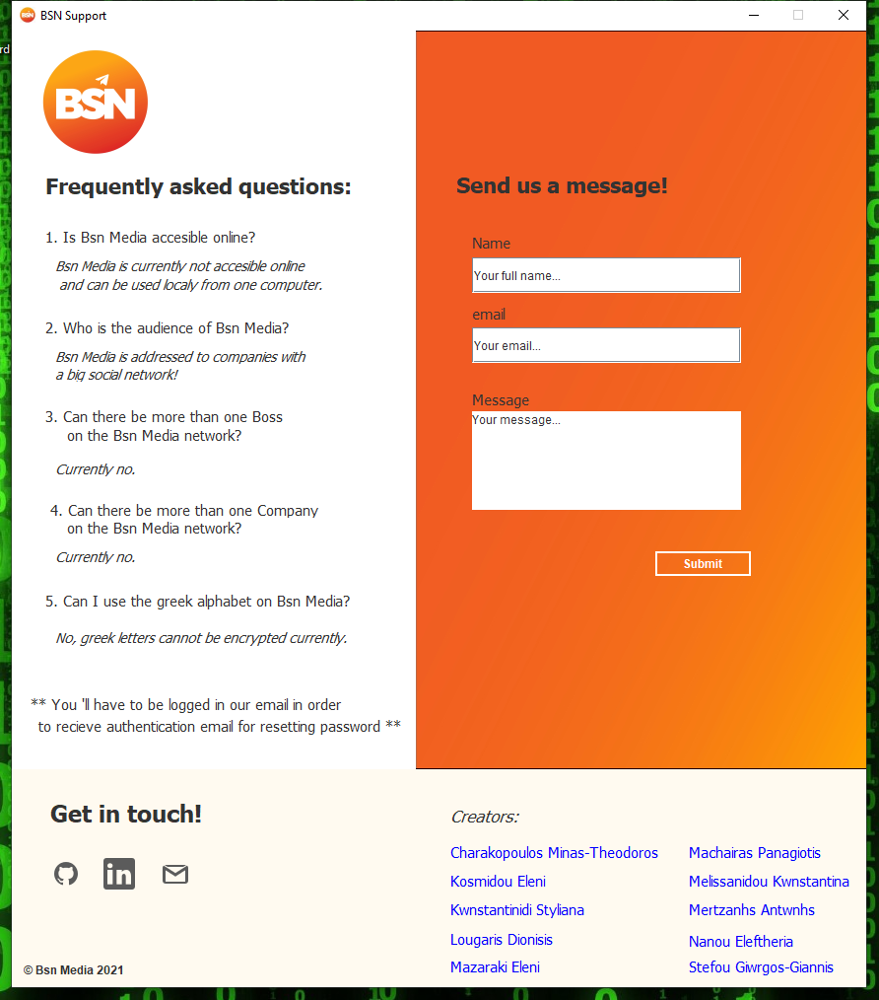

# Where is the data stored?
<h4>Binary file: </h4>All user and company data, except messages.
<h4>Text file .txt: </h4>All conversations are stored there encrypted.

# Installation
<ul>
	<li><b>You must have the java 1.6.0+ version installed</b></li>
</ul>

<h4>Step 1: Move to https://github.com/DionisisLougaris/BsnMedia/releases/tag/v1.0</h4>
<h4>Step 2: Click to download "BSN_setup.exe"</h4>
<h4>Steps 3,4</h4>

  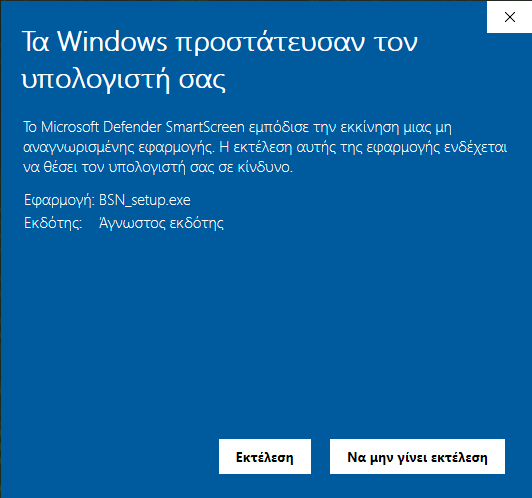
  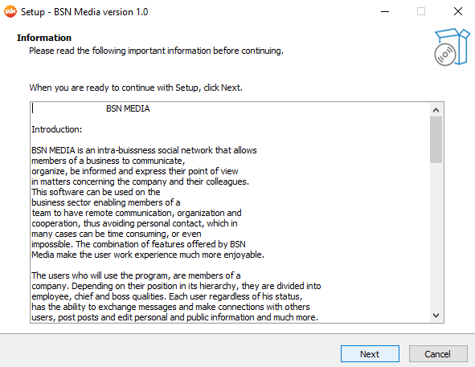

<h4>Steps 5,6</h4>

  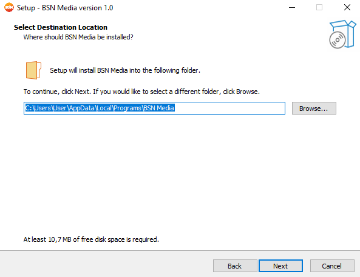
  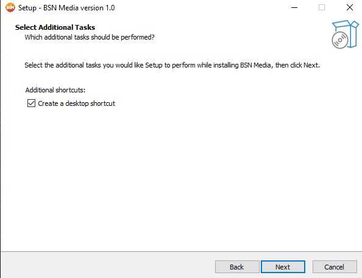

<h4>Steps 7,8</h4>

  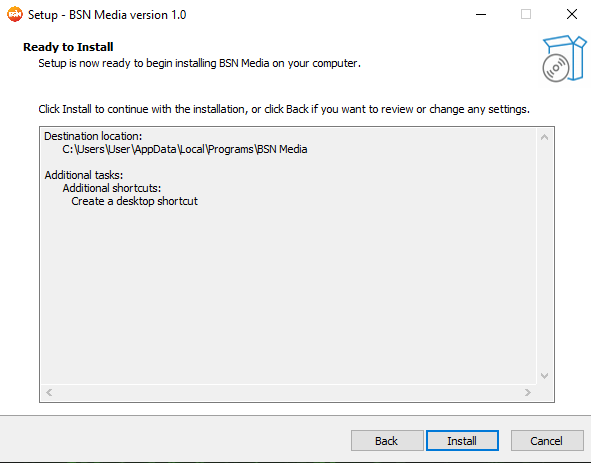
  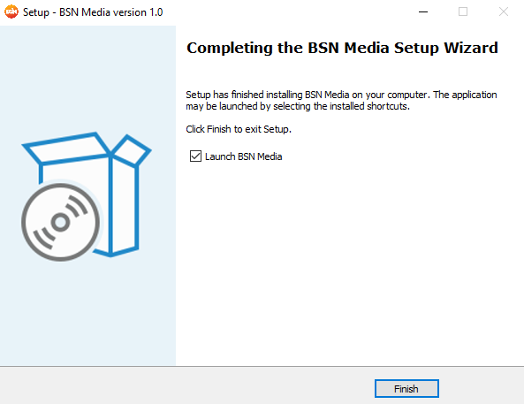

